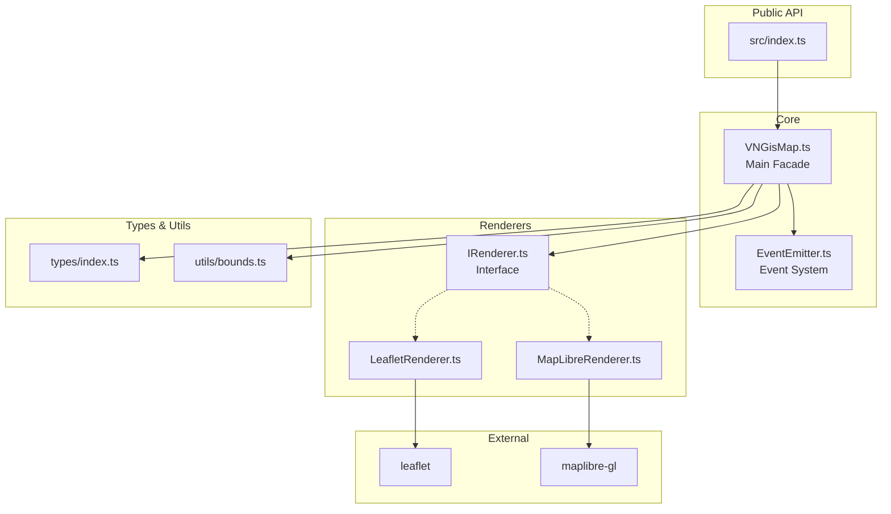
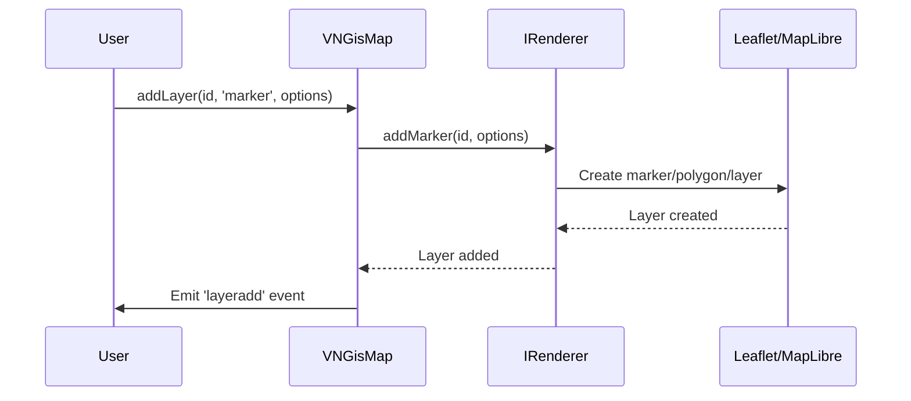
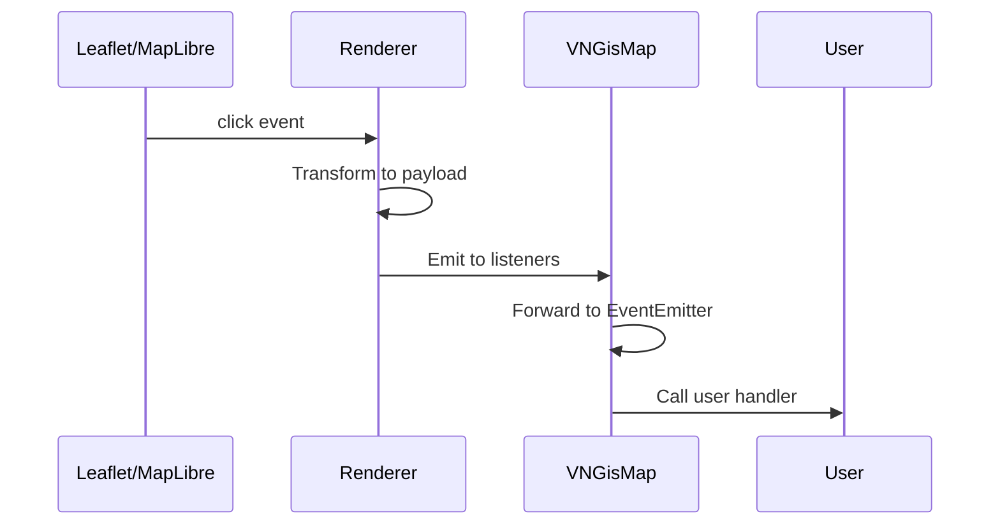

# Kiến trúc - @vn-gis/map v2.0.0

## Tổng quan

`@vn-gis/map` được thiết kế như một thư viện bản đồ nhẹ cung cấp API thống nhất để render bản đồ với sự hỗ trợ cho nhiều engine map rendering bên dưới.

## Sơ đồ kiến trúc



## Cấu trúc thư mục

```
src/
├── index.ts                    # Main entry point
├── core/
│   ├── VNGisMap.ts            # Main facade class
│   └── EventEmitter.ts         # Event system
├── renderers/
│   ├── base/
│   │   └── IRenderer.ts        # Renderer interface
│   ├── leaflet/
│   │   ├── LeafletRenderer.ts  # Leaflet implementation
│   │   └── index.ts
│   └── maplibre/
│       ├── MapLibreRenderer.ts # MapLibre implementation
│       └── index.ts
├── types/
│   └── index.ts               # Type definitions
└── utils/
    ├── bounds.ts               # Vietnam constants
    └── index.ts
```

## Các thành phần cốt lõi

### 1. VNGisMap (Facade Pattern)

Class chính cung cấp public API. Nó:

- Chấp nhận các tùy chọn cấu hình
- Tạo và quản lý renderer phù hợp
- Ủy thác các operations cho renderer
- Chuyển tiếp events từ renderer
- Duy trì trạng thái layer

```typescript
class VNGisMap extends EventEmitter {
  constructor(config: MapConfig)
  
  // Layer operations
  addLayer(id, type, options)
  removeLayer(id)
  
  // Map navigation
  setView(center, zoom?)
  fitBounds(bounds)
  
  // Event subscription
  on(event, handler)
  off(event, handler)
  
  // Lifecycle
  destroy()
}
```

### 2. IRenderer (Interface Pattern)

Định nghĩa contract mà tất cả renderers phải implement:

```typescript
interface IRenderer {
  initialize(container: HTMLElement, options: MapOptions): void
  addMarker(id: string, options: MarkerOptions): void
  addPolygon(id: string, options: PolygonOptions): void
  addGeoJSON(id: string, options: GeoJSONOptions): void
  removeLayer(id: string): void
  setView(center: LatLng, zoom?: number): void
  fitBounds(bounds: BoundsTuple): void
  on(event: string, handler: EventHandler): void
  off(event: string, handler: EventHandler): void
  destroy(): void
}
```

### 3. LeafletRenderer

Implement `IRenderer` cho Leaflet:

- Import thư viện Leaflet động
- Chuyển đổi options sang Leaflet API
- Xử lý chuyển tiếp events
- Sử dụng `L.marker()`, `L.polygon()`, `L.geoJSON()`

### 4. MapLibreRenderer

Implement `IRenderer` cho MapLibre GL JS:

- Import thư viện MapLibre động
- Sử dụng GeoJSON sources và layers
- Xử lý styling đặc thù MapLibre
- Sử dụng `map.addLayer()` với pattern source/layer

### 5. EventEmitter

Hệ thống event đơn giản được sử dụng bởi VNGisMap:

```typescript
class EventEmitter {
  on(event, handler)      // Subscribe
  off(event, handler)     // Unsubscribe
  once(event, handler)    // Subscribe một lần
  emit(event, data?)      // Emit event
  removeAllListeners()     // Cleanup
}
```

## Các Design Patterns

### 1. Adapter Pattern

Mỗi renderer adapt API thống nhất sang thư viện map cụ thể:

```
VNGisMap.addLayer('id', 'marker', options)
         |
         v
IRenderer.addMarker('id', MarkerOptions)
         |
         +---> LeafletRenderer --> L.marker()
         +---> MapLibreRenderer --> map.addLayer()
```

### 2. Factory Pattern

VNGisMap tạo renderer phù hợp dựa trên cấu hình:

```typescript
if (config.renderer === 'maplibre') {
  this.renderer = new MapLibreRenderer();
} else {
  this.renderer = new LeafletRenderer();
}
```

### 3. Facade Pattern

VNGisMap cung cấp interface đơn giản hơn so với việc quản lý trực tiếp các renderers và layers.

### 4. Observer Pattern

EventEmitter implement observer pattern cho event handling:

```
EventEmitter.on('click', handler)
         |
         v
Map.on('click', handler) --> Renderer.on('click', handler)
```

## Luồng dữ liệu

### Thêm một Layer



### Xử lý Events



## Các hằng số

Các hằng số đặc thù cho Việt Nam được cung cấp:

```typescript
VN_BOUNDS         // Giới hạn địa lý Việt Nam
VN_CENTER         // Điểm trung tâm Việt Nam
VN_DEFAULT_ZOOM   // 6 - Zoom xem toàn Việt Nam
VN_MIN_ZOOM      // 5 - Zoom tối thiểu
VN_MAX_ZOOM      // 18 - Zoom tối đa
VN_CITY_ZOOM     // 12 - Zoom cấp thành phố
VN_DISTRICT_ZOOM // 14 - Zoom cấp quận/huyện
VN_STREET_ZOOM   // 16 - Zoom cấp đường/phố
```

## Các định dạng Build

Thư viện tạo ra nhiều định dạng bundle:

| Format | File | Sử dụng |
|--------|------|---------|
| ESM | `dist/index.esm.js` | Bundler hiện đại (webpack, rollup, vite) |
| CJS | `dist/index.cjs.js` | Node.js, CommonJS bundlers |
| UMD | `dist/index.umd.js` | Browser `<script>` tags |
| Types | `dist/index.d.ts` | TypeScript definitions |

Sub-path exports:

| Path | Mô tả |
|------|--------|
| `@vn-gis/map` | Package chính |
| `@vn-gis/map/leaflet` | Leaflet renderer |
| `@vn-gis/map/maplibre` | MapLibre renderer |

## Mở rộng thư viện

Để thêm renderer mới (ví dụ: OpenLayers):

1. Tạo `src/renderers/openlayers/OpenLayersRenderer.ts`
2. Implement `IRenderer` interface
3. Export từ `src/renderers/openlayers/index.ts`
4. Cập nhật `VNGisMap` để hỗ trợ renderer mới
5. Cập nhật `rollup.config.ts` để build renderer mới
6. Cập nhật exports trong `package.json`

## Các cân nhắc về hiệu suất

1. **Dynamic Imports**: Renderers được load theo yêu cầu
2. **Layer Management**: Layers được lưu trong Map để truy cập O(1)
3. **Event Handling**: Events được chuyển tiếp hiệu quả sử dụng Sets
4. **Tree Shaking**: Định dạng ESM cho phép bundlers loại bỏ code không sử dụng
